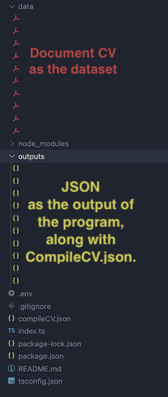

# CV Data Extractor

This project is a PDF CV Data Extractor that processes PDF files containing CVs, extracts relevant data, and compiles the extracted data into a JSON file (`compileCV.json`). The project uses a document processor to handle the extraction and includes a delay between processing each file to avoid hitting rate limits.

> I am using package from [`@racsodev/cv-pdf-to-json`](https://www.npmjs.com/package/@racsodev/cv-pdf-to-json).

## Requirements

- TypeScript (v4 or higher)
- Node.js (v14 or higher)
- npm (v6 or higher)
- ts-node (v10 or higher)
- ApiKey from Anthropic to use [Claude LLM](https://www.anthropic.com/api)

## Installation

1. Clone the repository:

   ```sh
   git clone https://github.com/ayusudi/cv-data-extractor.git
   cd cv-data-extractor
   ```

2. Install the dependencies:

   ```sh
   npm install
   ```

3. Create .env file. Here is the template :

   ```
   ANTHROPIC_API_KEY=
   ```

4. Ensure you have a data directory in the root of the project containing the PDF files to be processed. Take a look on this project structure :

   <details>
   <summary><b>Expand this to see project structure</b></summary>

   

   </details>

## How to Run

1. Run the script:
   ```sh
   npx ts-node index.ts
   ```
2. If it works perfectly, it will generate a result folder, outputs, and a compileCV.json file.

## Result

The script processes each PDF file in the [data](http://_vscodecontentref_/2) directory, extracts the CV data, and compiles the results into a JSON file named [compileCV.json](http://_vscodecontentref_/3). The script includes a 60-second delay between processing each file to avoid hitting rate limits.

The [compileCV.json](http://_vscodecontentref_/4) file will contain an array of objects, each representing the extracted data from a CV. Here is an example of the structure:

```json
[
  {
    "lastName": "string",
    "firstName": "string",
    "address": "string",
    "email": "string",
    "phone": "string",
    "linkedin": "string",
    "github": "string",
    "personalWebsite": "string",
    "professionalSummary": "string",
    "jobTitle": "string",
    "school": "string",
    "schoolLowerCase": "string",
    "promotionYear": "number",
    "professionalExperiences": [
      {
        "companyName": "string",
        "title": "string",
        "location": "string",
        "type": "string",
        "startDate": "number",
        "endDate": "number",
        "ongoing": "boolean",
        "description": "string",
        "associatedSkills": ["string"],
        "duration": "number"
      },
      ...
    ],
    "otherExperiences": [],
    "educations": [
      {
        "degree": "string",
        "institution": "string",
        "location": "string",
        "startDate": "number",
        "endDate": "number",
        "ongoing": "boolean",
        "description": "string",
        "associatedSkills": ["string"],
        "duration": "number"
      },
      ....
    ],
    "hardSkills": ["string"],
    "softSkills": ["string"],
    "languages": ["string"],
    "publications": ["string"],
    "distinctions": ["string"],
    "hobbies": ["string"],
    "references": ["string"],
    "certifications": [
      {
        "title": "string",
        "issuer": "string",
        "issuedDate": "number or null"
      },
      ...
    ]
  },
  ...
]
```
